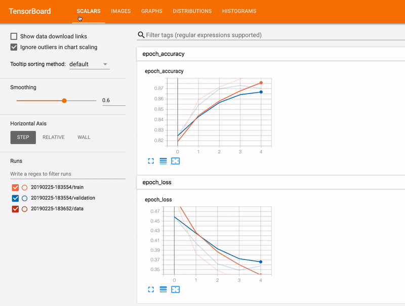

# TensorBoard as a CML Application

[](https://www.tensorflow.org/tensorboard)

This repository demonstrates a minimal example of running [TensorBoard](https://www.tensorflow.org/tensorboard) as an [Application](https://docs.cloudera.com/machine-learning/cloud/applications/topics/ml-applications.html) on CML by visualizing the training of a simple neural network on the MNIST digits dataset. The example used in this repo has been adapted from [this notebook](https://github.com/tensorflow/tensorboard/blob/master/docs/get_started.ipynb[).

## Repository Structure

```
.
├── cml                     # This folder contains scripts that facilitate the project launch on CML.
├── images                  # Storage for the images in this README
├── logs                    # Storage for the TensorBoard logs
├── load_and_train.py       # Simple script to train a model and capture logs
├── .project-metadata.yaml  # Declarative specification of this project
├── LICENSE                 # This code has an Apache 2.0 License
├── README.md               # This file
└── requirements.txt        # Python 3 package requirements
```


## Launching the project on CML

There are three ways to launch this project on CML:

1. **From Prototype Catalog** - Navigate to the AMPs tab on a CML workspace, select the "TensorBoard" tile, click "Launch as Project", click "Configure Project"
2. **As ML Prototype** - In a CML workspace, click "New Project", add a Project Name, select "ML Prototype" as the Initial Setup option, copy in the repo URL, click "Create Project", click "Configure Project"
3. **Manual Setup** - In a CML workspace, click "New Project", add a Project Name, select "Git" as the Initial Setup option, copy in the repo URL, click "Create Project". Launch a Python 3 Workbench Session and run `!pip3 install -r requirements.txt` to install requirements. Then create a CML Application as described in the [CML documentation](https://docs.cloudera.com/machine-learning/1.1/applications/topics/ml-applications.html), using `cml/launch_tensorboard.py` as the script.

## Using the App

Once the CML Application has been created (by any means), you can launch it from the Applications pane. This should open a browser window displaying the TensorBoard dashboard. To track your own custom model development, configure your training script to save logs to the `logs` directory. For more information on configuring TensorBoard and advanced features, see the [official documentation](https://www.tensorflow.org/tensorboard/get_started).